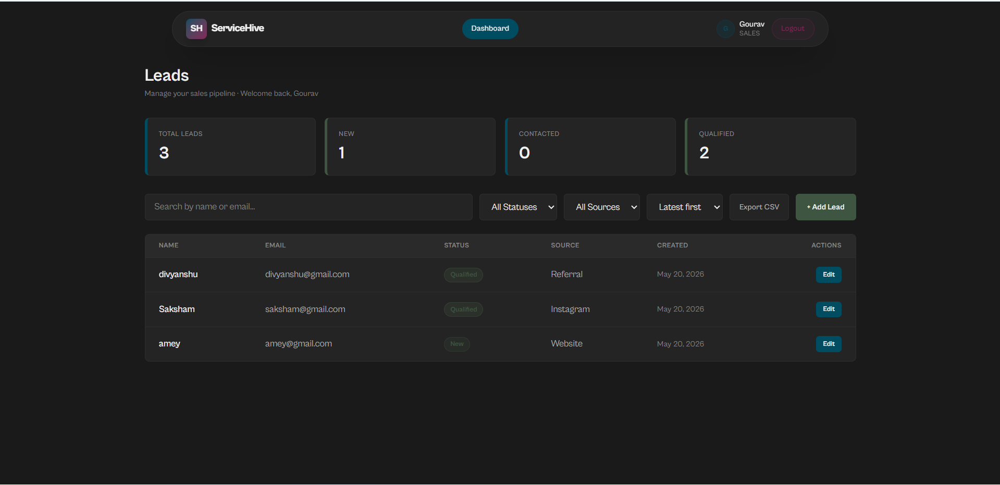
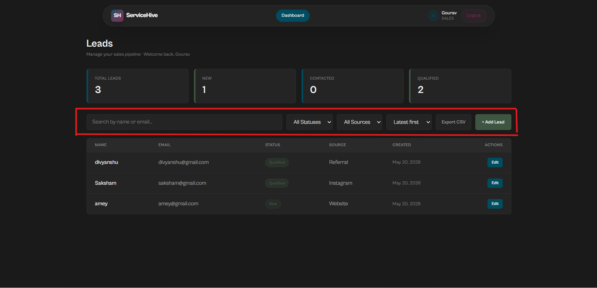

# ServiceHive — Smart Leads Dashboard

A full-stack lead management dashboard built with the MERN stack and TypeScript. Designed to streamline lead tracking with role-based access control, real-time filtering, and automated Docker deployments.

## 🚀 Live Demo

- **Frontend:** https://smart-leads-gules.vercel.app/login
- **Backend API:** https://smart-leads-r6ld.onrender.com
- **API Docs:** https://smart-leads-r6ld.onrender.com/api-docs

---

## 📸 Screenshots

### Login Page


### Dashboard


### Lead Filters


---

## ✅ Assignment Checklist

### Core Features
- JWT Authentication (Register, Login, Protected Routes)
- Leads CRUD (Create, Read, Update, Delete)
- Advanced Filtering (Status + Source + Search — working together seamlessly)
- Backend Pagination (10 items/page with metadata)
- Responsive Dashboard UI
- RESTful API with proper HTTP status codes

### Mandatory Additional Features  
- Debounced Search (400ms delay to optimize API calls)
- CSV Export
- Role-Based Access Control (Admin vs. Sales)
- Docker Setup (Containerized client, server, and database)

### Bonus
- Dark Mode Implementation

---

## 💻 Tech Stack

- **Frontend**: React.js, TypeScript, TailwindCSS, Redux Toolkit
- **Backend**: Node.js, Express.js, TypeScript, MongoDB, Mongoose
- **Auth**: JWT, bcrypt, Role-Based Access Control (Admin + Sales)
- **Infra**: Docker, Docker Compose

---

## 📂 Project Structure

```text
smart-leads/
├── .gitignore
├── docker-compose.yml
├── README.md
├── client/                 # React + TypeScript + TailwindCSS
│   ├── public/
│   │   ├── favicon.svg
│   │   └── icons.svg
│   ├── src/
│   │   ├── assets/
│   │   ├── components/
│   │   ├── hooks/
│   │   ├── pages/
│   │   ├── services/
│   │   ├── store/
│   │   ├── types/
│   │   ├── utils/
│   │   ├── App.tsx
│   │   ├── index.css
│   │   └── main.tsx
│   ├── .dockerignore
│   ├── .env
│   ├── .env.example
│   ├── .gitignore
│   ├── Dockerfile
│   ├── eslint.config.js
│   ├── index.html
│   ├── nginx.conf
│   ├── package-lock.json
│   ├── package.json
│   ├── README.md
│   ├── tailwind.config.js
│   ├── tsconfig.app.json
│   ├── tsconfig.json
│   ├── tsconfig.node.json
│   └── vite.config.ts
└── server/                 # Node.js + Express + TypeScript
    ├── .postman/
    │   └── resources.yaml
    ├── postman/
    │   ├── collections/
    │   ├── environments/
    │   ├── flows/
    │   ├── globals/
    │   ├── mocks/
    │   └── specs/
    ├── src/
    │   ├── config/
    │   ├── controllers/
    │   ├── middleware/
    │   ├── models/
    │   ├── routes/
    │   ├── types/
    │   ├── utils/
    │   └── index.ts
    ├── .dockerignore
    ├── .env
    ├── .env.example
    ├── Dockerfile
    ├── package-lock.json
    ├── package.json
    └── tsconfig.json

```

---

## 🛠️ Setup Instructions

### Prerequisites

* Node.js 18+
* MongoDB running locally (or Docker)
* npm or yarn

### Option 1 — Docker (Recommended)

```bash
git clone [https://github.com/Gourav-Chouhan-IT/smart-leads.git](https://github.com/Gourav-Chouhan-IT/smart-leads.git)
cd smart-leads
docker compose up --build

```

* **Frontend:** http://localhost:3000
* **Backend:** http://localhost:5000
* **MongoDB:** localhost:27017

### Option 2 — Manual Setup

**Backend:**

```bash
cd server
cp .env.example .env
npm install
npm run dev

```

**Frontend:**

```bash
cd client
cp .env.example .env
npm install
npm run dev

```

* **Frontend:** http://localhost:5173
* **Backend:** http://localhost:5000

---

## 📖 API Documentation

### Auth Endpoints

| Method | Endpoint | Description | Auth |
| --- | --- | --- | --- |
| POST | `/api/auth/register` | Register a new user | No |
| POST | `/api/auth/login` | Login user | No |

**Register Body:**

```json
{
  "name": "Gourav",
  "email": "gourav@example.com",
  "password": "123456",
  "role": "admin"
}

```

**Login Body:**

```json
{
  "email": "gourav@example.com",
  "password": "123456"
}

```

### Lead Endpoints

| Method | Endpoint | Description | Auth | Role |
| --- | --- | --- | --- | --- |
| GET | `/api/leads` | Get all leads (paginated) | Yes | Admin, Sales |
| POST | `/api/leads` | Create a new lead | Yes | Admin, Sales |
| GET | `/api/leads/:id` | Get lead by ID | Yes | Admin, Sales |
| PUT | `/api/leads/:id` | Update a lead | Yes | Admin, Sales |
| DELETE | `/api/leads/:id` | Delete a lead | Yes | Admin only |

**Query Parameters for `GET /api/leads`:**

| Param | Type | Description |
| --- | --- | --- |
| page | number | Page number (default: 1) |
| limit | number | Items per page (default: 10) |
| status | string | Filter by status (New, Contacted, Qualified, Lost) |
| source | string | Filter by source (Website, Instagram, Referral) |
| search | string | Search by name or email |
| sort | string | Sort order (latest, oldest) |

**Create/Update Lead Body:**

```json
{
  "name": "Gourav Chouhan",
  "email": "gourav@gmail.com",
  "status": "New",
  "source": "Website",
  "phone": "+1234567890",
  "company": "Acme Inc.",
  "message": "Interested in our services"
}

```

**Paginated Response:**

```json
{
  "success": true,
  "data": [...],
  "pagination": {
    "total": 25,
    "page": 1,
    "pages": 3,
    "limit": 10
  }
}

```

---

## 🔐 Environment Variables

### Server

| Variable | Description |
| --- | --- |
| `PORT` | Server port (default: 5000) |
| `MONGO_URI` | MongoDB connection string |
| `JWT_SECRET` | Secret key for JWT signing |
| `JWT_EXPIRES_IN` | Token expiry (default: 7d) |
| `NODE_ENV` | Environment (development/production) |

### Client

| Variable | Description |
| --- | --- |
| `VITE_API_URL` | Backend API base URL |

*Note: The frontend automatically appends `/api` if it is not included.*

---

## 👥 Default Users

Register with role `admin` for full access or `sales` for limited access.

* **Admin**: Can create, read, update, and delete leads
* **Sales**: Can create, read, and update leads (no delete)

---

## 👨‍💻 Author

**Gourav Chouhan**

* GitHub: @Gourav-Chouhan-IT

```

```